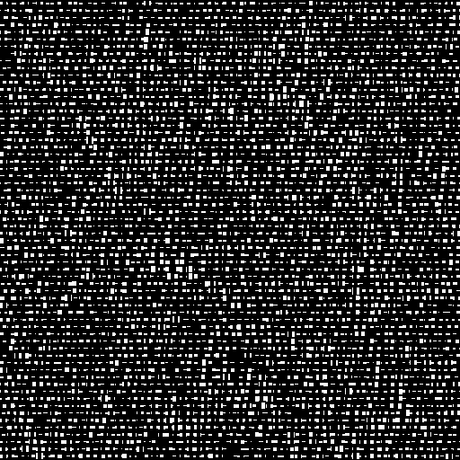
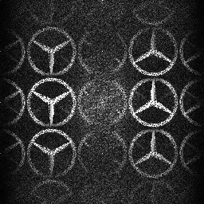
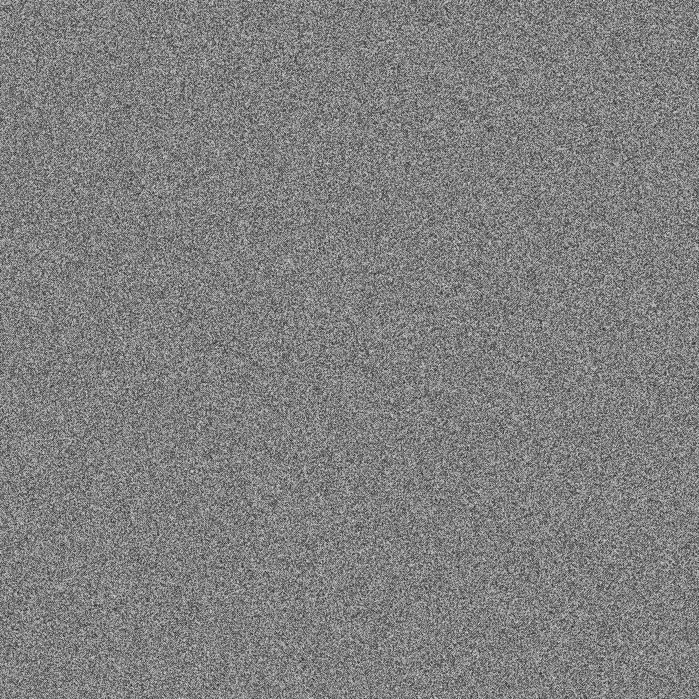
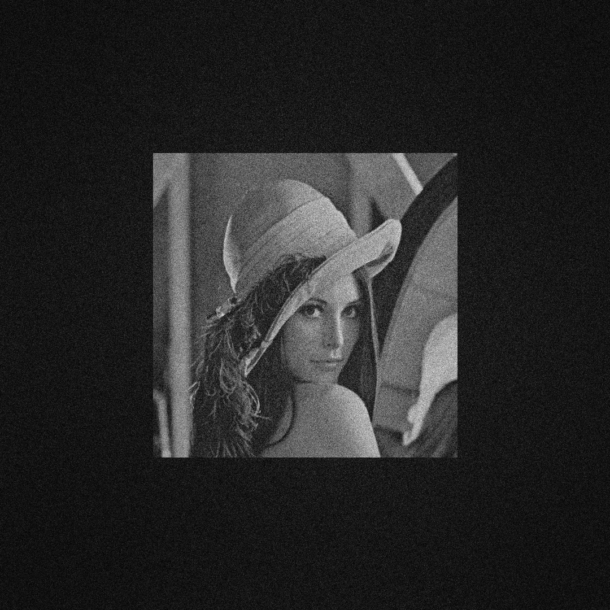
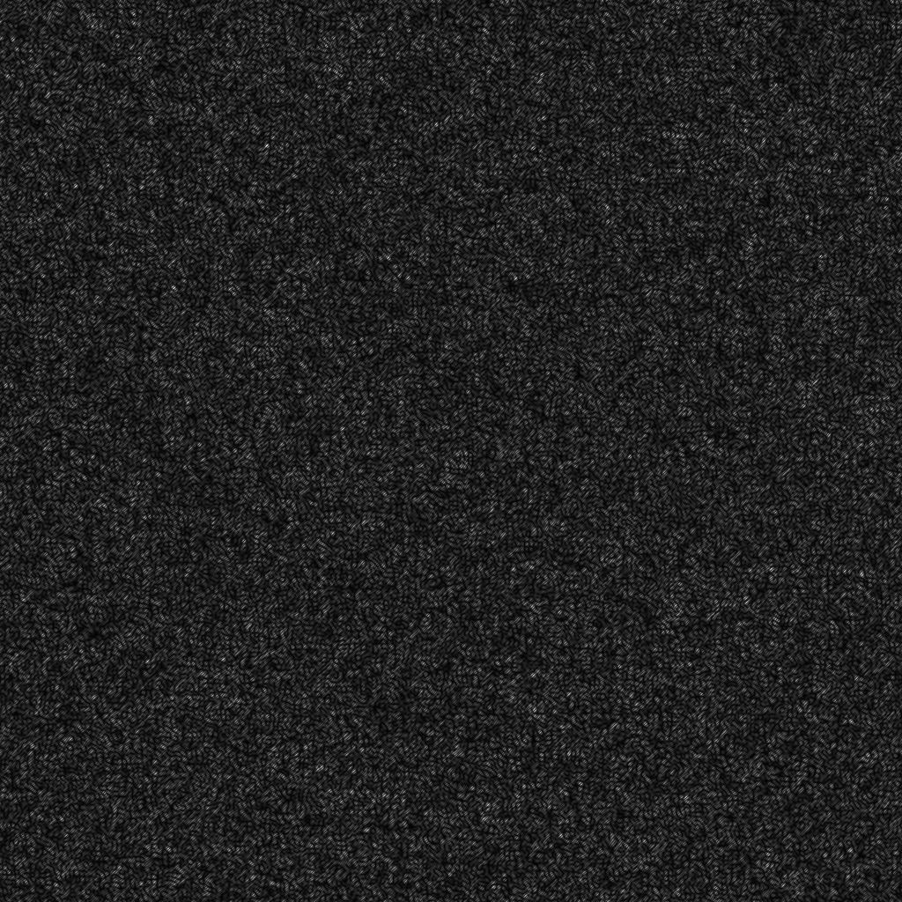
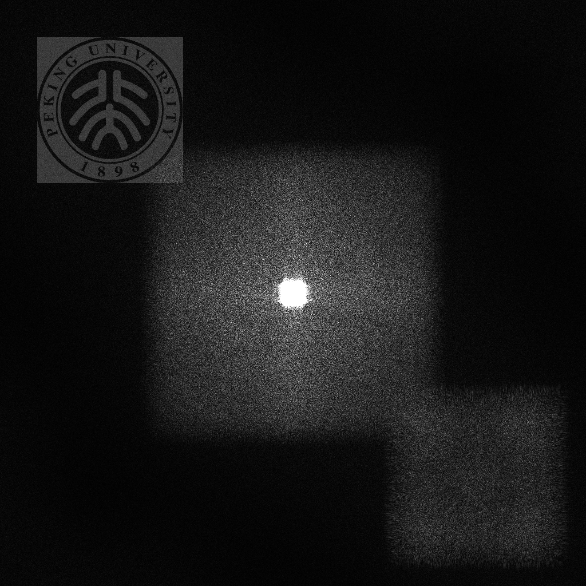

## Experiment

### Before Experiment

Before experimenting, it's best to understand common image formats and their fundamentals. Understanding the pixel level of an image will help you experiment better and give you a better understanding of the fundamentals of image processing.

Here are some examples of images you should pay more attention to the suffix of the image, and the size of the image, so that you can work with the image later.

### Fourier Hologram

Circuitous Phase Type Hologram/Fourier Hologram is Binary hologram.

#### DataSet

For this experiment we used this image for testing

#### Experimental Principle

Please read this [Doc](Fourier_Hologram/README.md)ument.

#### Experimental Procedure

Two ways to do experiments are provided here, Matlab or Python, and you can choose the familiar way to run the code.

- Run the `fourier_hologram.m` or `fourier_hologram.py`, They are in the Python and Matlab folders respectively.
- Then you will get Circuitous Phase Type Hologram/Fourier Hologram below.

+ Finally, after running the program, you can get the reproduced graph and compare it with the original image.

### Kinoform

#### DataSet

For this experiment we used this image for testing

#### Experimental Principle

Please read this [Doc](Kinoform/README.md)ument.

#### Experimental Procedure

Two ways to do experiments are provided here, Matlab or Python, and you can choose the familiar way to run the code.

- Run the `kinoforms.m` or `kinoforms.py`, They are in the Python and Matlab folders respectively.
- Then you will get Kinoform below.

- Finally, after running the program, you can get the reproduced graph and compare it with the original image.

### Off Axis Interference Hologram

#### DataSet

For this experiment we used this image for testing

#### Experimental Principle

Please read this [Doc](Interference_Hologram/README.md)ument.

#### Experimental Procedure

Two ways to do experiments are provided here, Matlab or Python, and you can choose the familiar way to run the code.

- Run the `offaxis_interference_hologram.m` or `offaxis_interference_hologram.py`, They are in the Python and Matlab folders respectively.
- Then you will get Off Axis Interference Hologram below.

- Finally, after running the program, you can get the reproduced graph and compare it with the original image.

