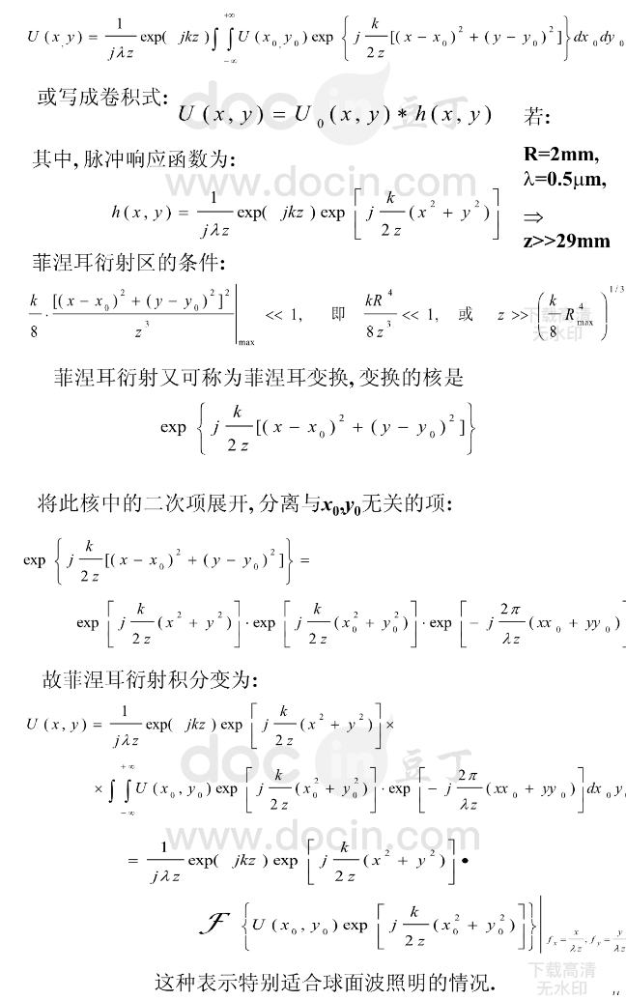
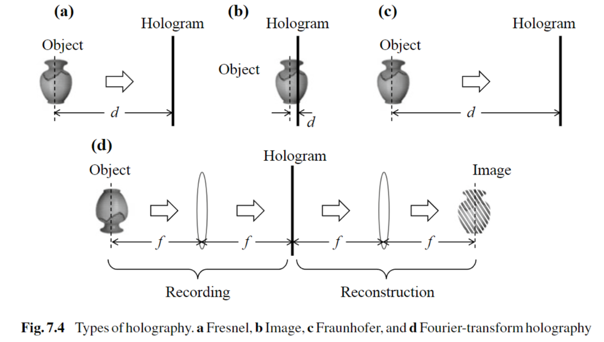
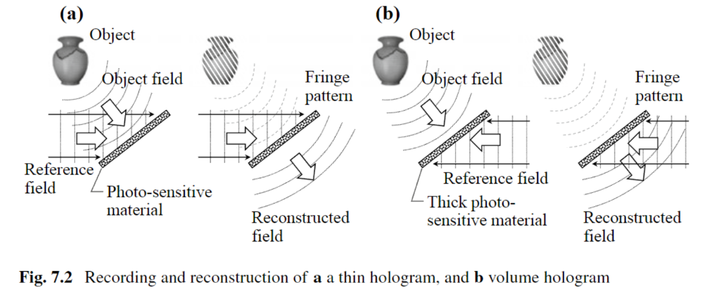
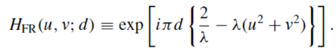
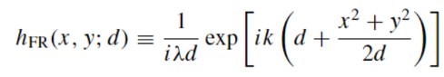
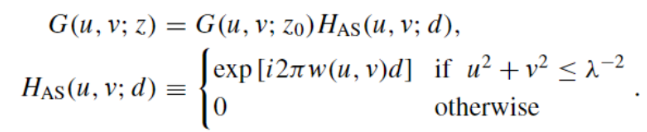
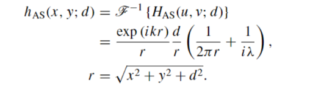
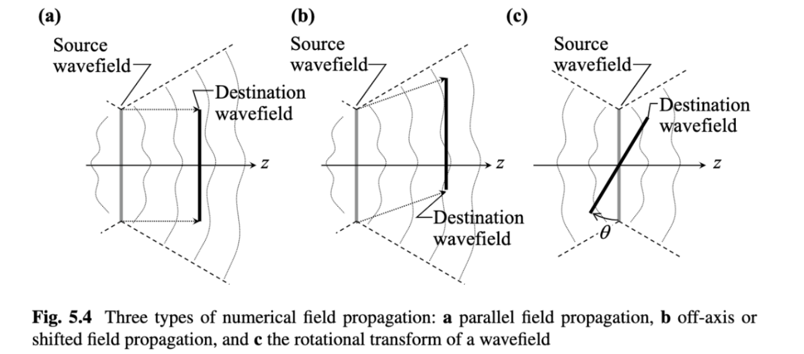
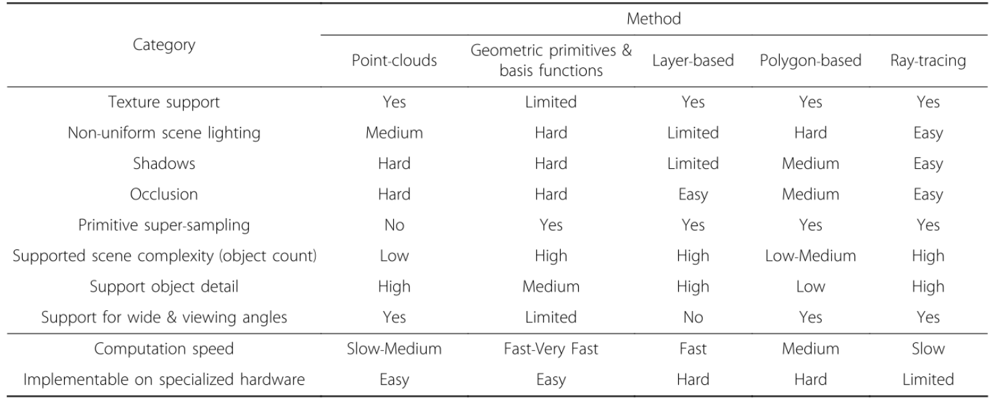
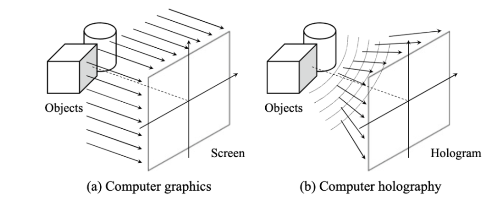

Tips：

- 基于振幅的全息图会**产生共轭像【菲涅尔离轴参考光全息图】**、基于相位的全息图不会【**相息图**】、基于傅里叶变换的全息图会产生很多像【**傅里叶全息图**】，其中最中间的像最清晰
- **像全息图，菲涅尔全息图，夫琅禾夫全息图**是根据**物与像的距离**来判断，**角谱法【场传播】**这不涉及距离限制，一般夫琅禾夫全息图可用**凸透镜**代替
- 常见分类：**基于点，基于多边形，基于层，立体全息图，基于射线**
- **POH相比AOH衍射效率更高**，效果更好，更常用，且不会产生共轭像。AOH提高衍射效率一般需要手动添加**C_hist**参数
- **将空间复函数表示的信号转变为透过率变化函数的过程称为编码**
- RGB 通道中采用的红绿蓝光波长分别为 **633nm、532nm、450nm**，采样间隔为 21μm、19μm、17μm
- 菲涅耳离轴全息图的制作过程包括了**菲涅耳衍射和离轴参考光干涉**两个部分
    - **离轴参考光干涉**
    - **菲涅耳衍射：**指通过菲涅耳衍射积分来计算物体在全息记录面的物光波前，具体来说它由以下两步组成：(1)使用菲涅耳衍射积分来计算原始物体上每一点到达全息记录面的菲涅尔衍射光波(2)对到达全息记录面的原始物体上的每一点的菲涅尔衍射光波进行叠加
    
    

    
- 数值场的传播基于**标量绕射理论**
- **Helmholtz方程**用来求解波传播场的算子
- **计算全息的视角定义为物场最大衍射角的两倍**
- 对于傅里叶变换全息术，**计算全息尺寸越大，焦距越短，视角越大**。

### 全息分类【大全】

**光学**角度（物体与记录平面距离）：

- 像全息图：超近距离
- 菲涅尔全息图：适中距离
    - 基于卷积计算
    - 基于傅里叶变换计算
- 夫琅禾夫全息图：远距离
- 傅里叶变换【凸透镜全息图】

光学记录材料分类：

- 薄全息图（thin hologram）：**条纹波矢量K几乎平行于材料的表面**。
- 体全息图（volume hologram）：**条纹波矢量K近似垂直于表面**

计算**平面间传播场**的方式：

- 菲涅尔衍射方法【基于单傅里叶变换和基于卷积计算】
    - 传递函数
    
    
    
    - 传播核
    
    
    
- **角谱法**
    - 传递函数
    
    
    
    - 传播核
    
    
    

编码复值函数的方式分类：

- 使用**两个实值函数来表示复值函数**，两个实值函数分别记录了物体的幅值和相位信息，对幅值进行编码可以采用空间脉冲带宽调制的方法，对相位编码可以采用空间脉冲相位调制的方法
- 模仿**光学全息图编码方式**，在制作离轴光学全息图时，使用离轴参考光偏置分别对物体波面进行调幅和调相，从而转化为实值函数，便可以记录在全息平面上

数值场传播方式分类：

- **最基本的传播**；**源波场在与源波场平行的平面中传播到目的波场**
- **离轴传播或移位传播**
- **波场的旋转变换**

**CGH**分类【****Traditional Heuristic Methods****】：

- **Point-based** methods：点光源，基于物理的方法，模拟了从3D场景到全息图平面的光传输过程。例如：双相位编码全息图
- **Polygon-based** methods：将3D对象视为数千个多边形，而不是数百万个点。将每个多边形视为一个多边形孔径，将所有多边形孔径的衍射图形相加得到CGHs
- **Layer-based** methods：将三维物体划分为平行于全息图平面的多个层，每一层都作为一个独立的计算单元。然后利用菲涅尔衍射计算各层的子全息图，将所有子全息图叠加得到cgh。
- **Ray-tracing**：射线追踪是一种**模拟光传输**的计算机图形技术。其主要思想是**跟踪通过虚拟场景和与材料交互的单个光线，准确计算到达虚拟相机每个像素的光量**。
- Geometric primitives & basis functions：全息图可以由**比点扩散函数(psf)更复杂的元素生成**。在许多情况下，2D和3D对象可以分解为相对较少的基本元素，可以有效地计算。
- ****Holographic Stereograms：****以数字方式生成或以光学方式捕获的角度多路复用二维（2D）视差视图，全息图在空间上被分割为多个全息元素（HOGEL）

---

- **Color** Holographic Display
    - **空间**复用
    - **时间**复用

从**SLM**角度：

- 单SLM
    - AOH：仅振幅
    - POH：仅相位
- 多SLM
    - 振幅相位分别用一个SLM再现
    - 双相位全息图(DPH)
    - 全息图漂白法
    - 双约束迭代法

**Holographic optimization algorithm**：

- **Phase** optimization method
    - 迭代算法
        - **GS，GSW，Fienup，AA**
        - 误差扩散算法
    - 非迭代算法
        - 随机相位
        - 采样类方法
        - 模式化掩膜与二次相位掩膜
        - **双相位编码**
        - 非随机相位
    - 直接计算
        - 直接搜索算法(Direct Search Algorithm)
        - 模拟退火算法(Simulated Annealing Algorithm)
        - 遗传算法(Genetic Algorithm)
    - 迭代与非迭代结合
    - 基于 Wirtinger Flow的相位提取
    - **深度学习**

宏观**全息图**分类：

- **在光学全息术中，物场的编码过程是通过与参考场的光学干涉提供的**,最终确定的感光材料是全息图。
- 在**计算机全息术**中，**必须使用打印机打印条纹图案t(x，y)来制作计算全息图**，然后从打印的条纹重建3D图像。
- 在**电子全息术中，条纹图案不是打印出来的，而是由某些电子设备直接显示出来的**。

Algorithmic **CGH acceleration** techniques：

- Sparsity
- Wavefront recording planes
- Stereogram approximations
- Coefficient shrinking methods
- Look-up tables
- Dynamic CGH acceleration techniques
- **Deep-learning based acceleration**

**计算机全息术和计算机图形学：**

- **CG将光线视为一组仅垂直于屏幕传播的光线**
- **计算机全息术将光视为波场，它不仅包括垂直于全息图的光的分量，而且包括以不同角度传播到全息图平面的光的所有分量**

