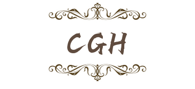

# Computer-Generated-Hologram
✨This library introduces the current production process of computer holography, and uses MATLAB and Python to record and reproduce holograms. In the future, I will build a computer hologram simulation framework or a simulation application program.



## Introduction

CGH stands for computer-generated holograms (CGH). Holograms are unique in their ability to record both the intensity and phase of information.

More Resource to learn holography 👉 [Awesome Holography](./Doc/Awesome.md)👈

Summary of CGH Tips: [Tips](./Doc/Tips.md)

### Types of CGH
- **Point-based** methods
- **Polygon-based** methods
- **Layer-based** methods
- **Ray-tracing**
- **Geometric primitives & basis functions**
- **Holographic Stereograms**


### Phase Optimization Methods

#### Overview
- Iterative Method
    - GS，GSW，Fienup，AA
    - Error Diffusion Method
- Non-Iterative Method
    - Random Phase
    - Sample Method
      - Sampled-Phase-only Hologram
      - Complementary phase-only hologram
      - Adaptive Down-Sampling Mask
    - Patterned Phase-Only Hologram and Quadratic Phase
    - **Double-Phase Method**
    - Non-Random Phase-Free Method
- Direct Computation
    - Direct Search Algorithm
    - Simulated Annealing Algorithm
    - Genetic Algorithm
- Combination of iteration and non-iteration
- Wirtinger Flow
- **Deep Learning**


#### Iterative Method

The iterative algorithm usually starts from an approximation of the target hologram, and continuously optimizes the approximate hologram through a series of repeated operations until the reconstructed image obtained by the approximation meets certain error requirements.

##### GS-Base Algorithm

According to the amplitude distribution of the hologram plane and the reconstructed image plane, the phase information of the light field in the hologram plane can be obtained by iterating the forward and reverse light wave transmission and the restrictions imposed on the two planes.

|           Algorithm            |                            Paper                             |                     Link                     |
| :----------------------------: | :----------------------------------------------------------: | :------------------------------------------: |
| GS(Gerchberg-Saxton) Algorithm | 👉[Paper](https://scholar.google.com/scholar?q=A%20practical%20algorithm%20for%20the%20determination%20of%20phase%20from%20image%20and%20diffraction%20plane%20pictures) |   [Code](Python/phase_optimization/iterative_methods/GS.py)   |
|        Fienup Algorithm        | 👉[Paper](https://labsites.rochester.edu/fienup/wp-content/uploads/2019/07/OEngr1980_ITAimRecCGH.pdf) | [Code](Python/phase_optimization/iterative_methods/Fienup.py) |

##### Error Diffusion Method

The error diffusion algorithm iterates between the pixels of the hologram plane in turn, rather than between the hologram plane and the object image plane，Without any information of the object image, only the complex amplitude hologram itself can be directly operated on it and a pure phase hologram can be calculated.

|         Algorithm         | Paper  |                         Link                          |
| :-----------------------: | :----: |:-----------------------------------------------------:|
| Error Diffusion Algorithm | 👉Paper | [Code](Python/phase_optimization/iterative_methods/Error_Diffusion.py) |

### Complex Amplitude Modulation

- [x] Double-Phase hologram (DPH)：[Code](./Python/double_phase_hologram.py) | [Paper](https://opg.optica.org/ao/ViewMedia.cfm?uri=ao-17-24-3874&seq=0&guid=ff8146ce-78dc-4f66-875b-e6334fb4969e&html=true)
- [ ] Hologram bleaching
- [ ] Double-constraint iterative method

### Propagation Field

#### Fresnel diffraction method
- Based on single Fourier transform and Convolution calculation.
- Fresnel diffraction propagator is implemented [Here](./Python/propagator/fresnel_diffraction.py).

#### Angular spectrum method
- Angular spectrum propagator is implemented [Here](./Python/propagator/angular_spectrum.py).


## CGH Examples

|                    CGH Type                     |                  Document                   |                       Link                        |
|:-----------------------------------------------:| :-----------------------------------------: |:-------------------------------------------------:|
| Circuitous Phase Type Hologram/Fourier Hologram |   👉[Doc](Doc/Fourier_Hologram/README.md)    |       [Code](./Python/fourier_hologram.py)        |
|                  Kinoform【POH】                  |       👉[Doc](Doc/Kinoform/README.md)        |           [Code](./Python/kinoforms.py)           |
|              Fresnel Hologram【AOH】              |                    👉Doc                     |       [Code](./Python/fresnel_hologram.py)        |
|       Off Axis Interference Hologram【AOH】       | 👉[Doc](Doc/Interference_Hologram/README.md) | [Code](./Python/offaxis_interference_hologram.py) |
|            Layer_Based Hologram【POH】            |                    👉Doc                     |                    [Code](./Python/layer_based_method.py)                     |


## Usage

Working on a hologram simulation API.

```shell
git clone https://github.com/JackHCC/Computer-Generated-Hologram.git
cd Computer-Generated-Hologram
pip install requirements.txt
```


## Experiment

Go 👉[Here](./Doc/Experiment.md)👈 to try generating CGH！

You can get some awesome holograms and images!


## Contact

If you have any questions or good ideas, please contact: jackcc0701@163.com


## References

- Hao-zhen BU, Shu-ming JIAO. Review of computer-generated phase-only hologram optimization algorithm[J]. Chinese Journal of Liquid Crystals and Displays, 2021, 36(6):810-826. DOI： 10.37188/CJLCD.2021-0035.
- Pi, D., Liu, J. & Wang, Y. Review of computer-generated hologram algorithms for color dynamic holographic three-dimensional display. Light Sci Appl 11, 231 (2022).
- David Blinder, Tobias Birnbaum, Tomoyoshi Ito, Tomoyoshi Shimobaba. The state-of-the-art in computer generated holography for 3D display[J]. Light: Advanced Manufacturing 3, 35(2022).

